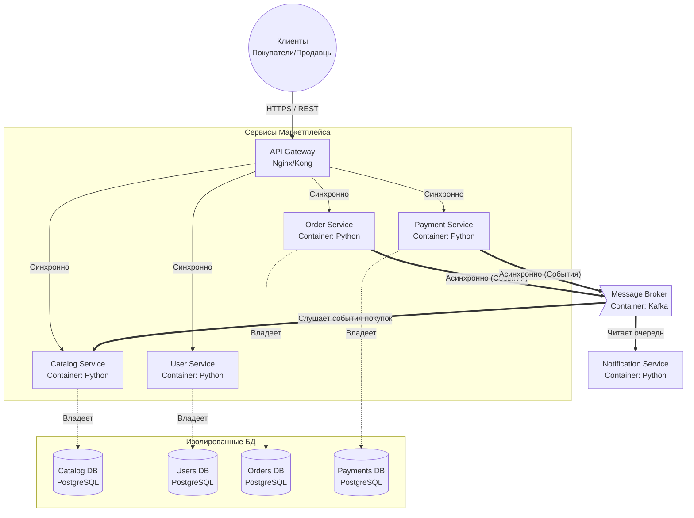

# Архитектура маркетплейса

## 1. Запуск проекта

Реализован базовый сервис для проверки инфраструктуры

```sh
docker compose up -d
```

```sh
curl http://localhost:8080/health
# Ответ: {"status": "ok"}
```

## 2. C4-диаграмма



## 3. Домены, сервисы и владение данными

Используется паттерн **Database-per-service**

Логика распределения - каждый сервис инкапсулирует один домен, чтобы команды могли разрабатывать и масштабировать их независимо

1. **User Service**

- Ответственность:
  - Регистрация, аутентификация, профили

- Данные (Users DB):
  - Учетные данные, роли (продавец/покупатель)

2. **Catalog Service**

- Ответственность:
  - CRUD товаров для продавцов, выдача ленты
- Реализация персонализации:
  - Сервис асинхронно слушает события об успешных заказах из брокера, при выдаче ленты товары из категорий, которые пользователь покупал ранее, ранжируются выше

- Данные (Catalog DB):
  - Карточки товаров, категории, счетчики покупок для персонализации

3. **Order Service**

- Ответственность:
  - Управление корзиной и флоу заказа (создан -> оплачен -> доставлен)
- Данные (Orders DB):
  - Состав заказа, текущий статус

4. **Payment Service**

- Ответственность:
  - Процессинг оплат

- Данные (Payments DB):
  - Транзакции, чеки, статусы оплат

5. **Notification Service**

- Ответственность:
  - Отправка email/push о статусах заказов
- Данные:
  - Без персистентной БД, полностью stateless, берет всю информацию из событий брокера

**Взаимодействие сервисов:**

- **Синхронно (REST/gRPC):**
  - Запросы клиентов на чтение (получить ленту) или действия, где ответ нужен сразу (создать профиль)
- **Асинхронно (Broker):**
  - Реакция на события

Пример: Order Service создает заказ -> кидает ивент "OrderCreated" в брокер -> Payment Service и Notification Service на него реагируют

## 4. Альтернативы и Trade-offы

**Вариант 1:**

- Модульный монолит
  - **Плюсы:**
    - Нет проблем с сетью, легко делать join-запросы (например, объединить пользователя, его заказ и описание товара в одном SQL-запросе), ACID-транзакции из коробки
  - **Минусы:**
    - Упадет один модуль - может упасть весь маркетплейс
    - Невозможно масштабировать только каталог, придется дублировать всё приложение целиком

**Вариант 2:**

- Микросервисы с изолированными БД
  - **Плюсы:**
    - Независимое масштабирование (каталог можно отмасштабировать х10 от платежей), изоляция отказов (упали уведомления - заказы все равно принимаются)
  - **Минусы:**
    - Потеря простых joinов в базе
    - Сложность распределенных транзакций
    - Повышенные требования к инфраструктуре, нужно поддерживать брокер сообщений

## 5. Обоснование финального выбора

**Выбран вариант 2**

**Аргументация на основе ограничений:**

- Маркетплейс - это система с жестко асимметричной нагрузкой

- Домен каталога (поиск и скроллинг ленты) испытывает в десятки раз большую нагрузку на чтение, чем домен платежей и заказов на запись
  - Монолит не позволит точечно залить ресурсами только каталог

- Также требование отправки уведомлений о статусах идеально ложится на брокера сообщений
  - Оформление заказа не должно тормозить или падать из-за того, что почтовый сервер временно недоступен
